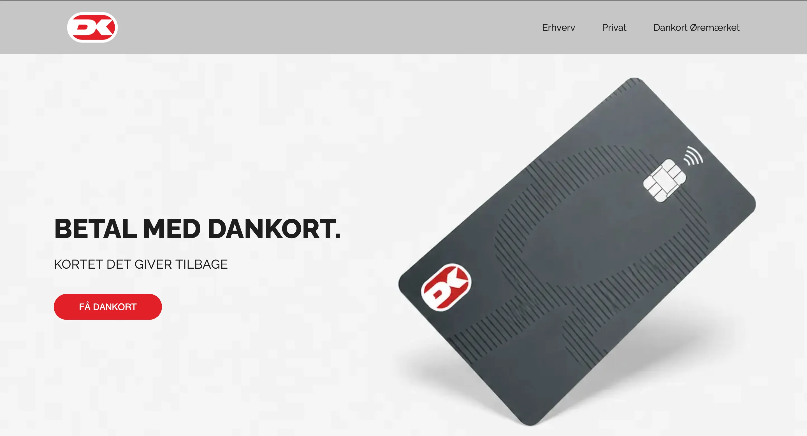

# Multimedia Portfolio

A single-page, scrollable portfolio built with plain HTML, CSS and JavaScript.

## 1. Replace the text

Open `index.html` and replace:

- `YOUR NAME`
- `Your Name`
- email address
- LinkedIn link
- project descriptions
- live project URLs (`href="#"`)

## 2. Add your own project images

Put your images in these folders:

- `assets/dankort/`
- `assets/agoodcase/`
- `assets/clothing/`
- `assets/hojskolen/`

The template currently expects:

- `01.jpg`
- `02.jpg`
- `03.jpg`
- `04.jpg`

You can use PNG or WebP instead. Just change the file paths in `index.html`.

To add more images to a project, duplicate this line inside that project's `.gallery`:

```html
<figure class="gallery-slide">
  
</figure>
```

The image counter updates automatically.

## 3. Add floating project logos / symbols

Put transparent PNG or SVG files in:
`assets/symbols/`

Then replace the existing placeholder paths in `index.html`.

Examples:

- `assets/symbols/dankort-symbol-1.png`
- `assets/symbols/dankort-symbol-2.png`

If you only want one symbol, remove the second ``.

## 4. Live links

Each project has:

```html
<a class="project-link" href="#" target="_blank" rel="noopener">
  View live project ↗
</a>
```

Replace `#` with your real URL.

## 5. Run locally

Open `index.html` directly in your browser, or use a simple local server.

If using VS Code, the "Live Server" extension is convenient.

## 6. Deploy

This site can be deployed easily to:

- GitHub Pages
- Netlify
- Vercel

No build tools are required.
